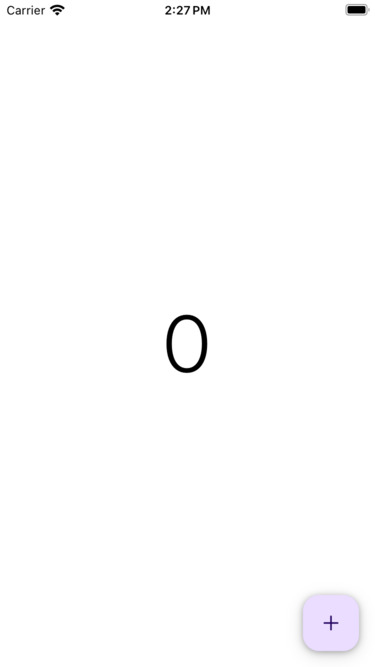

# Counter - React Native

A counter app developed in react native using react native cli. The app use the component library react native paper and react-native-vector-icons for te icons.

## Functionality

This app has a counter and a button to increase to counter. When you do a simple tap the counter increments and y you press a long time the counter is reset.

